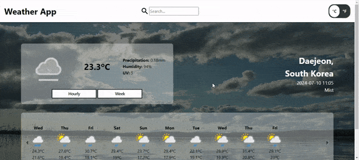
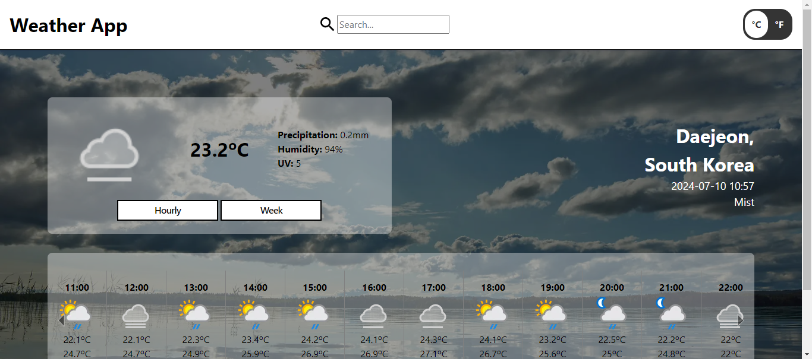
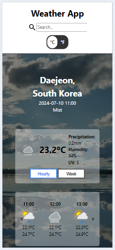

# The Odin Project - Weather App

## Objective

Using Promises, Async, await, and API. Creating a weather app that uses https://www.weatherapi.com/ to let the user search for the desired location and show the results on the page. Also, include a switch to change between Fahrenheit and Celsius.

### Key Points:
- Using promises to fetch the API data.
- Using Async function to Await the fetch data then display it to the user.
- Make the site change with the weather reported.
- Use images or GIFs to show the correct data.
- Handle bad user input.
- Make the app device-friendly.

## Model 
### Index

|  Desktop | Mobile   | 
|----------|----------|
| ||

This application was a great experience in handling APIs and managing data. Using async functions and await was crucial in handling and fetching the data, so I got lots of hands-on experience dealing with both successful and failed requests. Adding `await` to necessary functions helped keep the app running smoothly. 

The addition of the loading icon did amazing work with the UI, keeping the user notified when the data is fetching and when it isn't. Also, handling API errors inside a `try...catch` block ensures that users are notified through an alert if their input is incorrect.

Handling the Celsius and Fahrenheit toggle was simpler than anticipated. By adding both C and F data and then using a hide class on one of the temperature types, an `addEventListener` could be used to toggle the class to show and hide the correct temperature.

This project was another great way to get more hands-on experience with `display` and turning ideas into reality by positioning containers correctly and handling various screen sizes by manipulating the document accordingly.

## Problems Encountered
- Creating a function carousel to display hours and days.
- Accessing API JSON data.
- Creating a loading icon.

## New Skills Acquired
- Using a previous image carousel and altering it to stop when it reaches the frame width.
- Using async and await to wait for the API to be fetched before accessing the data.
- Using an SVG icon and adding rotating animation with `@keyframes` to show and hide when waiting for the API.

## Technologies Used
- HTML
- CSS
- JavaScript
- WeatherAPI